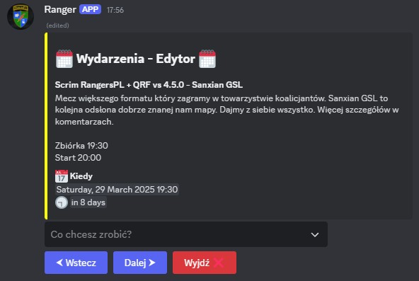
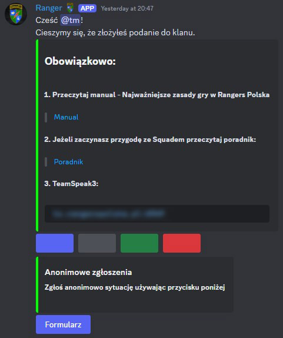

## Discord Bot

Bot wspomagający zarządzanie dla organizacji gamingowej  

---

## Wykorzystane technologie

* Java
* Spring Boot
* Maven
* MySql
* Lombok
* Mockito
* Junit 5

#### Java Discord API
* [DV8FromTheWorld / JDA](https://github.com/DV8FromTheWorld/JDA)

---

## Funkcje

* Zapisy na eventy.

  

  

* Interaktywne tworzenie eventów.

  

* Interaktywne zarządzanie eventami.

  

* Automatyczne rozsyłanie przypomnień na event zapisanym użytkownikom.
* Automatyczne zamykanie i czyszczenie kanałów eventowych.
* Rekrutacja do organizacji w formie ticketu.
  * Wstępna weryfikacja usera i akceptacja przez osoby zarządzające procesem.
  * Funkcje do automatyzacji przyjęcia, odrzucenia, finalizacji rekrutacji.
  * Opiniowanie rekrutów przez memberów.
  * Anonimowe zgłoszenia przez rekrutów.

  

* Automatyczne czyszczenie kanałów rekrutacyjnych.
* Support serwera — zgłoszenia w formie ticket'a.

  

* Archiwizacja kanału z załącznikami po zamknięciu ticketu dla wsparcia serwera.
* Automatyczne zamykanie i usuwanie ticketow przez brak aktywności.
* Automatyczne seed call'e + konfiguracja z poziomu discorda.
* Statystyki z serwera dla każdego usera po użyciu komendy.

  

* Automatyczne dzienne statystyki z serwera.
* Interaktywne tworzenie i zarządzanie giveaway.
* Automatyczne przypomnienia o podbiciu serwera na disboard.
* Automatyczna zmiana rang/ról po wysłaniu pliku csv.
* Pobieranie ilości godzin z steam, zapisywanie do csv i wysyłane na prośbę użytkownika.
* Automatyczne nadwanie roli przy wejściu na serwer.
* Możliwość wybrania roli i przypisania sobie przy pomocy komendy.

  

* Ustawianie aplikacji przy pomocy slash komend.
* Gry i zabawy:
  * Rzut monetą.
  * Rzut kością.
  * Ranger of the day.
  * Random timeout z odwróconą krzywą prawdopodobieństwa.
  * Ranking reputacji.
  * Essa.
  * Urodziny (Wyświetlanie informacji o najbliższych urodzinach).
    * Automatyczne wyświetlanie, jeżeli ktoś obchodzi urodziny danego dnia.

  

